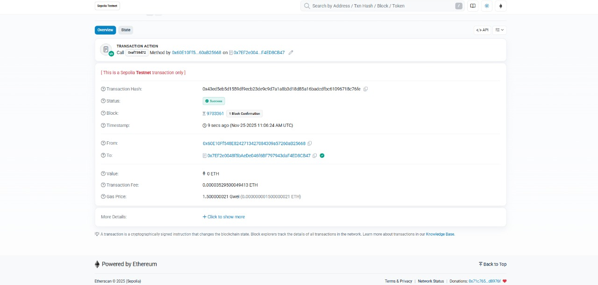
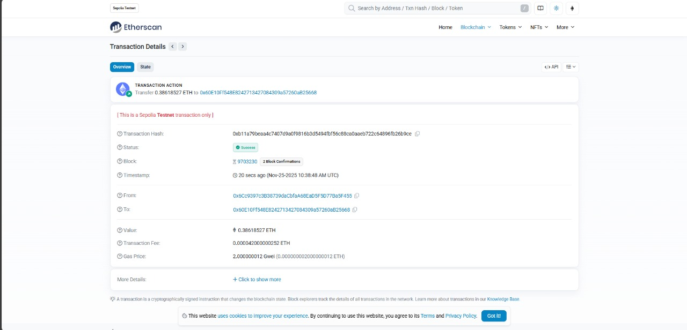
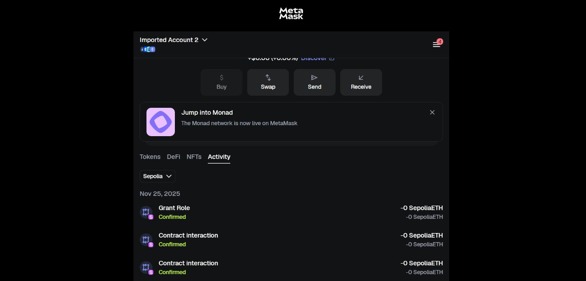

# 🚜 AgriSupplyChain Blockchain DApp

A decentralized supply chain tracker for agricultural produce, fully powered by smart contracts on Ethereum Sepolia [finance:Ethereum]. Built end-to-end—from Solidity code to a public dApp on Vercel—**for free and open testing by anyone**.

## ⭐ Problem Statement

Build a secure, transparent supply chain solution for agriculture using blockchain smart contracts. The dApp enables farmers, distributors, and retailers to add, track, update, and transfer produce, with full role-based access, real-time monitoring, and public verification.
- No central authority required.
- All records are cryptographically verifiable.

---

## 🚀 The Journey: Step-by-Step

### 1. **Smart Contract Design**
   - Drafted `AgriSupplyChain.sol` in Solidity.
   - Included core features: add produce, progress stages, view full tracking history, and manage access roles.
   - Tested deployment locally with [Remix IDE](https://remix.ethereum.org/).

### 2. **Free Blockchain Hosting**
   - **Network chosen:** Sepolia testnet (free, public Ethereum testnet).
   - Explored non-custodial free endpoints via Alchemy, Infura, ThirdWeb, and manual RPC setup.
   - Resolved issues with Mumbai/Amoy network deprecation and chain ID problems.

### 3. **Wallet Setup & Gas**
   - Used MetaMask to create wallet, switch to Sepolia.
   - Claimed **free test ETH** for network transactions from [Sepolia Faucets](https://sepoliafaucet.com), solved issues with wallet vs contract addresses.

### 4. **Contract Deployment**
   - Final deployment using Remix IDE to Sepolia.
   - Verified contract events and state changes via [Sepolia Etherscan](https://sepolia.etherscan.io/address/0x7EF2e0048f5bAeDe046f6BF797943daF4ED8CB47).

### 5. **Frontend Creation**
   - Built a complete responsive dApp in HTML/CSS/JS (ethers.js).
   - Connected all functions to blockchain, enabled live data aggregation.

### 6. **Free Public Hosting**
   - Deployed dApp on Vercel: [https://agrichain-dusky.vercel.app/](https://agrichain-dusky.vercel.app/)
   - Anyone can use, interact, and test the contract for free.

### 7. **Testing & Troubleshooting**
   - Resolved multi-account faucet confusion and ethers.js CDN errors.
   - Confirmed contract transactions (grant role, interaction, history) go live.
   - Ensured cross-device and cross-wallet compatibility.

### 8. **Documentation & Evidence**
   - Provided video demo and screenshots of working transactions.
   - Documented common errors and solutions.

---

## 🛠️ How Anyone Can Use This DApp **(for Free)**

### **1. Connect a MetaMask Wallet**
- Install [MetaMask](https://metamask.io/).
- Switch to **Sepolia Testnet**.

### **2. Get Free Sepolia ETH (If You Want to Write/Update)**
- Request test ETH from [Sepolia Faucet](https://sepoliafaucet.com).
- (No ETH needed to just view data!)

### **3. Visit the Hosted App**
- Link: [https://agrichain-dusky.vercel.app/](https://agrichain-dusky.vercel.app/)
- View real-time produce tracking, add/update items, manage access.

### **4. Etherscan Link for Direct Contract View**
- [Sepolia Etherscan](https://sepolia.etherscan.io/address/0x7EF2e0048f5bAeDe046f6BF797943daF4ED8CB47)

### **5. Demo/Proof**
- Images and demo video attached (`agri1.jpg`, `agri2.jpg`, `agri3.jpg`, `agri4.mp4`)
  - Show live balance updates, contract interactions, and successful network transactions.

---

## 📸 Evidence

[Demo Video](./agri4.mp4)

---

## ❓ Common Issues & Solutions

| Problem                                | Solution                                                      |
|-----------------------------------------|--------------------------------------------------------------|
| "Insufficient funds" in MetaMask        | Get more free Sepolia test ETH from faucet, check wallet addr |
| "ethers is not defined" (Vercel)        | Use official Cloudflare CDN for ethers.js                     |
| Can't interact with contract/no balance | Switch to correct account in MetaMask, make sure wallet ≠ contract addr |
| Want read-only access                   | Etherscan contract tab (no wallet needed)                     |
| Can't see contract on Remix             | Remix IDE sessions aren't shareable—use Vercel/Etherscan      |

---

## 📝 Difficulties and How We Solved Them

- **Network selection:** Mumbai deprecated, chain ID issues; solution: Sepolia via Alchemy/Infura.
- **Wallet vs contract address confusion:** Faucet and dApp must use MetaMask wallet (NOT contract).
- **CDN issues breaking ethers.js in Vercel:** Switched to Cloudflare CDN.
- **Multi-account management in MetaMask:** Ensured correct account selection for faucet and app usage.
- **Public sharing/remix limitations:** Used Etherscan and Vercel public hosting instead.

---

## ✔️ What You’ll Need to Test/Use

1. [MetaMask Extension](https://metamask.io/)
2. **Sepolia Testnet** selected in wallet
3. Sepolia ETH for contract actions (get for free from faucet)
4. Public dApp link: [https://agrichain-dusky.vercel.app/](https://agrichain-dusky.vercel.app/)
5. Any modern browser

---

